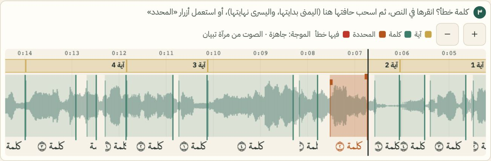
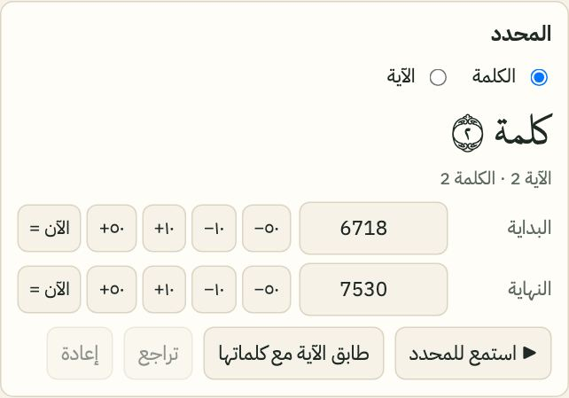
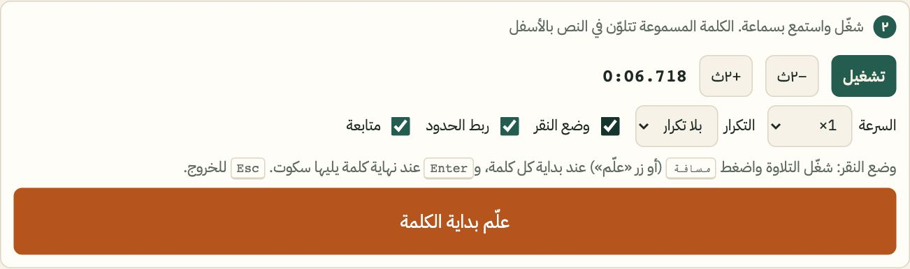
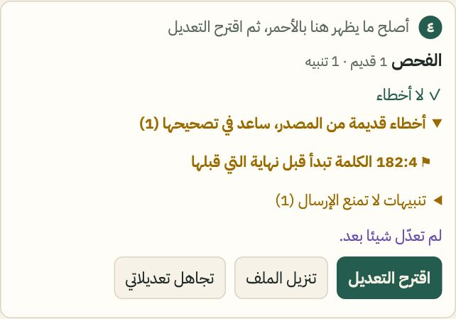
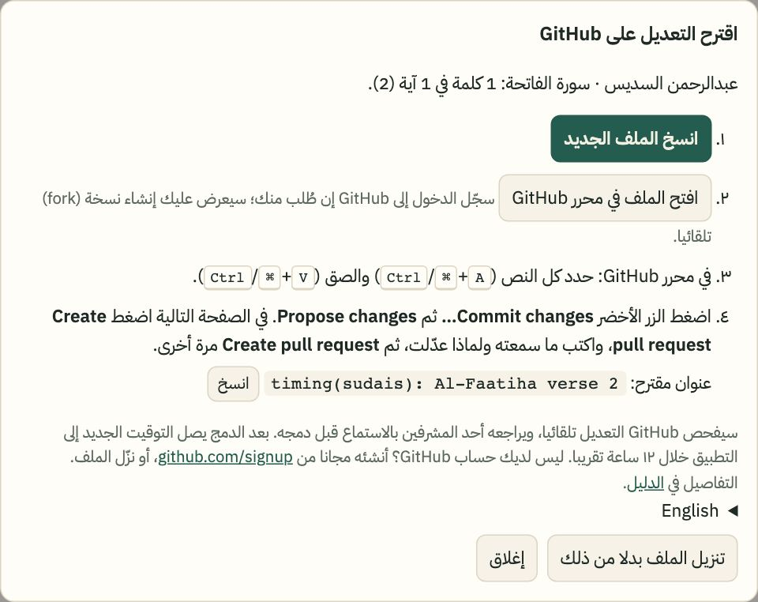
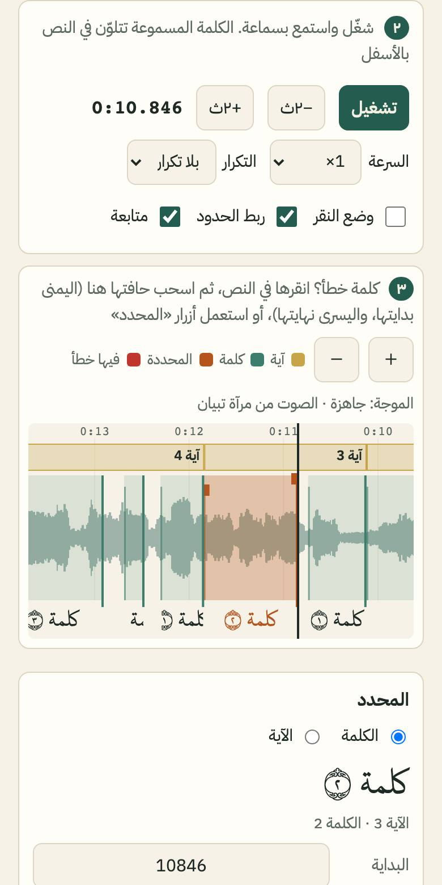

# دليل تصحيح توقيت التلاوة

تطبيق تبيان يلوّن الكلمة وقت قراءتها. أحيانا يسبق اللون الصوت أو يتأخر عنه. بهذا الدليل تصحح ذلك بأذنك، من المتصفح، بلا أي برنامج.

لا تحتاج خبرة برمجية. تحتاج سماعة، وربع ساعة.

> في صور هذا الدليل استُبدلت كلمات الآيات بعبارة «كلمة ١»، «كلمة ٢»... وفي المحرر نفسه ترى نص المصحف كما في التطبيق.

## الخطوات

### ١. افتح المحرر

افتح هذا الرابط: https://helalrules7.github.io/tibyan/

يعمل على الحاسوب والهاتف. الحاسوب أسهل في التعديل الدقيق.

### ٢. اختر القارئ والسورة

من القائمة الأولى اختر القارئ. ثم اختر السورة. ويمكنك القفز إلى آية من قائمة «الآية».

### ٣. شغّل واستمع بسماعة

اضغط «تشغيل». الكلمة المسموعة تتلوّن في النص، وخط أسود يتحرك على الموجة.

ضع السماعة. الخطأ في التوقيت يكون أجزاء من الثانية، ولا يُسمع جيدا من سماعة الهاتف الخارجية.

### ٤. كيف تعرف أن الكلمة خطأ؟

استمع وانظر معا. الكلمة خطأ إذا:

- تلوّنت **قبل** أن يبدأ القارئ بها.
- أو تلوّنت **بعد** أن بدأ بها بوضوح.
- أو بقيت ملوّنة وهو يقرأ الكلمة التالية.

أكثر الأخطاء تقع في هذه المواضع:

- آخر كلمة في الآية، وأول كلمة في الآية التالية.
- بعد مدّ طويل.
- بعد وقف أو سكتة داخل الآية.

إن شككت، خفّض السرعة إلى ٠٫٧٥ أو ٠٫٥ واسمع مرة أخرى.

### ٥. ما معنى «صحيح»؟

- الكلمة **تبدأ** عند أول حرف تسمعه منها.
- الكلمة **تنتهي** قبل أن تبدأ الكلمة التالية.
- السكوت بين آيتين **ليس لأي كلمة**. لا تمدّ كلمة لتغطيه.

### ٦. الطريقة الأولى: اسحب حافة الكلمة

انقر الكلمة في النص. يظهر مستطيلها على الموجة بلون برتقالي.

- **الحافة اليمنى** هي بدايتها (الوقت يسير من اليمين إلى اليسار، مثل الكتابة).
- **الحافة اليسرى** هي نهايتها.

ضع المؤشر على الحافة حتى يتغير شكله، ثم اسحبها إلى حيث يبدأ صوت الكلمة. الموجة تساعدك: بداية الكلمة غالبا حيث يرتفع الصوت بعد هدوء.

«ربط الحدود» مفعّل: إن كانت نهاية كلمة تلامس بداية التي بعدها، تتحركان معا.

### ٧. التعديل الدقيق بالأزرار

في لوحة «المحدد» أزرار تحرك البداية أو النهاية:

- **−١٠ و+١٠**: جزء من مئة من الثانية.
- **−٥٠ و+٥٠**: نصف عُشر الثانية، للتحريك الأسرع.
- **«= الآن»**: اجعل البداية (أو النهاية) لحظة التشغيل الآن. شغّل، وأوقف عند أول الكلمة، ثم اضغطه.

### ٨. الطريقة الثانية: وضع النقر

مناسبة لتصحيح كلمات كثيرة متتالية.

١. انقر أول كلمة تريد تصحيحها.
٢. فعّل «وضع النقر».
٣. خفّض السرعة إلى ٠٫٧٥ أو ٠٫٥.
٤. شغّل. اضغط **مسافة** لحظة بداية كل كلمة. (على الهاتف: الزر البرتقالي الكبير «علّم بداية الكلمة».)
٥. إن تلاه سكوت طويل، اضغط **Enter** عند نهاية الكلمة.
٦. اضغط **Esc** للخروج.

نهاية كل كلمة تصير بداية التالية تلقائيا.

### ٩. تحقق بالتكرار

من قائمة «التكرار» اختر «الكلمة» أو «الآية»، أو اضغط **L**. تُعاد الكلمة وحدها مرة بعد مرة. استمع: هل تبدأ بأول حرفها؟ هل ينتهي قبل الكلمة التالية؟

أو اضغط «▶ استمع للمحدد» لسماعها مرة واحدة.

أخطأت؟ اضغط «تراجع» (أو **Ctrl+Z**). كل تعديل يمكن التراجع عنه.

### ١٠. لوحة «الفحص»

تفحص اللوحة عملك وأنت تعدّل:

- **✕ خطأ** (أحمر): يجب إصلاحه قبل الإرسال. مثل: كلمة تبدأ قبل نهاية التي قبلها، أو كلمة خارج حدود آيتها. انقره ليأخذك إلى موضعه.
- **⚑ أخطاء قديمة من المصدر** (برتقالي): جاءت مع البيانات الأصلية. لا تمنع الإرسال. وتصحيحها من أنفع ما تساهم به.
- **! تنبيهات**: تداخلات صغيرة جدا. لا تمنع الإرسال، ولا تحتاج عملا.

إن قال «الكلمة خارج حدود آيتها»: اختر «الآية» في لوحة المحدد واسحب حدها، أو اضغط «طابق الآية مع كلماتها».

تعديلاتك محفوظة في متصفحك تلقائيا. إن أغلقت الصفحة، يسألك المحرر عند عودتك هل تستعيدها.

### ١١. أنشئ حساب GitHub (مرة واحدة)

الاقتراحات تُرسل عبر موقع GitHub، وهو مجاني.

١. افتح https://github.com/signup
٢. اكتب بريدك، وكلمة سر، واسم مستخدم.
٣. أكّد البريد بالرمز الذي يصلك.

### ١٢. أرسل التعديل

١. اضغط «اقترح التعديل». تظهر نافذة بالخطوات.
٢. اضغط «انسخ الملف الجديد».
٣. اضغط «افتح الملف في محرر GitHub». تفتح صفحة GitHub. إن طلب الدخول، ادخل بحسابك. وإن عرض إنشاء نسخة (fork)، وافق.
٤. في صفحة GitHub: انقر داخل النص، ثم حدّد الكل (**Ctrl+A**، وعلى ماك **⌘+A**)، ثم الصق (**Ctrl+V** أو **⌘+V**).
٥. اضغط الزر الأخضر **Commit changes…**. في النافذة اضغط **Propose changes**.
٦. في الصفحة التالية اضغط **Create pull request**. اكتب في الوصف ما سمعته وما غيّرته، مثلا: «البقرة ٢٥٥، الكلمة ٧ كانت تبدأ مبكرا». ثم اضغط **Create pull request** مرة أخرى.

لا تريد GitHub؟ اضغط «تنزيل الملف»، وأرسله لأحد المشرفين.

### ١٣. ماذا يحدث بعد ذلك؟

١. خلال دقائق يكتب فحص آلي تعليقا على طلبك: ✅ أو ❌ مع السبب.
٢. يفتح أحد المراجعين تعديلك في المحرر ويستمع إليه.
٣. إن كان صحيحا، يدمجه.
٤. خلال ١٢ ساعة تقريبا يصل التوقيت الجديد إلى التطبيق، بلا تحديث للتطبيق.

## آداب المساهمة

- **سورة واحدة في كل طلب.** هذا يسهّل المراجعة.
- **لا تغيّر ما لم تسمعه.** إن لم تسمع الكلمة بوضوح، اتركها.
- لا تخمّن. إن شككت، اكتب ذلك في وصف الطلب.
- تعديلاتك تُنشر برخصة CC BY 4.0، مثل بقية التوقيت.

## اختصارات لوحة المفاتيح

| المفتاح | العمل |
|---|---|
| مسافة | تشغيل وإيقاف. وفي وضع النقر: علّم بداية الكلمة |
| Enter | استمع للمحدد. وفي وضع النقر: نهاية الكلمة |
| ← → | الكلمة التالية / السابقة |
| , . | البداية −١٠ / +١٠ (مع Shift: ٥٠) |
| ; ' | النهاية −١٠ / +١٠ (مع Shift: ٥٠) |
| S / E | البداية / النهاية = الآن |
| L | التكرار: بلا ← الكلمة ← الآية |
| [ ] | أبطأ / أسرع |
| Ctrl+Z / Ctrl+Shift+Z | تراجع / إعادة |
| Esc | الخروج من وضع النقر |

الاختصارات تعمل بموضع المفتاح، فلا يهم إن كانت لوحتك عربية.

## على الهاتف

- **يعمل باللمس:** اختيار القارئ والسورة، التشغيل، لمس كلمة لاختيارها، أزرار ±١٠ و±٥٠ و«= الآن»، التكرار، السرعة، «علّم بداية الكلمة» في وضع النقر، الإرسال.
- **سحب الحواف:** يعمل بالإصبع، لكنه أقل دقة. كبّر الموجة بزر «＋» أولا. أو استعمل الأزرار.
- **السحب في مكان فارغ من الموجة** يحركها يمينا ويسارا. **لمسة** في مكان فارغ تنقل التشغيل إليه.
- النص طويل؟ مرّر داخل مربع النص نفسه.

---

# Guide: correcting recitation timings by ear

Tibyan highlights each word as it is recited. Sometimes the highlight is early or late. This guide shows you how to fix that by ear, in your browser. No programming needed: headphones and a quarter of an hour.

> In this guide's pictures the words of the verses are replaced by "word 1", "word 2"… In the editor you see the mushaf text as in the app.

## Steps

1. **Open the editor:** https://helalrules7.github.io/tibyan/ — it works on a computer and a phone; a computer is easier for fine work.
2. **Pick the reciter and the surah** (and a verse, if you like).
3. **Play and listen with headphones.** The word being recited is highlighted; a black line moves on the waveform.
4. **How to tell a word is off:** it lights up before the reciter starts it, or clearly after; or it stays lit while he reads the next word. Most mistakes are at the end of a verse and the start of the next, after a long madd, and after a pause (waqf) inside a verse. In doubt, slow down to 0.75 or 0.5.
5. **What "correct" means:** a word starts at its first audible letter and ends before the next word starts. The silence between two verses belongs to no word.
6. **Fix 1, drag the word's edge:** click the word; its box turns orange on the waveform. Time runs right to left, like the text: the right edge is the start, the left edge the end. Drag the edge to where the word's sound begins. "Link boundaries" moves two touching edges together.
7. **Fine-tune with the buttons:** ±10 and ±50 ms for the start or the end; "= now" sets it to the playback position.
8. **Fix 2, tap mode** (many words in a row): click the first word, turn on tap mode, slow down, press play and hit **Space** (on a phone: the big orange button) as each word starts; **Enter** at the end of a word followed by a long pause; **Esc** to leave.
9. **Check with a loop:** loop the word or verse (or press **L**), or "▶ play selection". Undo with **Ctrl+Z**.
10. **The checks panel:** ✕ errors must be fixed before sending (click one to go there). ⚑ old errors came with the source data; they don't block, and fixing them is very welcome. ! warnings are tiny overlaps; nothing to do. "Word outside its verse": select the verse and drag its edge, or press "fit verse to its words". Your edits are kept in your browser.
11. **Create a free GitHub account** once: https://github.com/signup
12. **Send it:** «اقترح التعديل» (propose the change) → "copy the new file" → "open the file in GitHub's editor" (sign in; accept the fork) → click in the text, select all, paste → **Commit changes…** → **Propose changes** → **Create pull request**, say what you heard and changed, and **Create pull request** again. Or download the file and send it to a maintainer.
13. **What happens next:** an automatic check comments within minutes (✅ or ❌ and why); a reviewer opens your change in the editor and listens; if it is right it is merged; the app picks it up within about 12 hours, without an app update.

**Etiquette:** one surah per pull request; don't change anything you didn't listen to; don't guess, say so if unsure. Your changes are published under CC BY 4.0 like the rest of the timings.

**Keyboard:** Space play/pause (tap mode: mark a start) · Enter play selection (tap mode: end of word) · ← → next/previous word · `,` `.` start −/+10 ms (Shift: 50) · `;` `'` end −/+10 ms (Shift: 50) · S / E start / end = now · L loop · `[` `]` slower / faster · Ctrl+Z / Ctrl+Shift+Z undo / redo · Esc leave tap mode. Keys work by position, whatever your keyboard layout.

**On a phone:** everything works by touch: pickers, play, tapping a word, the ±10/±50 and "= now" buttons, loop, speed, the big tap button, sending. Dragging edges works with a finger but is less precise: zoom in with "＋" first, or use the buttons. Dragging an empty part of the waveform scrolls it; a tap there moves playback. Scroll the text inside its own box.
